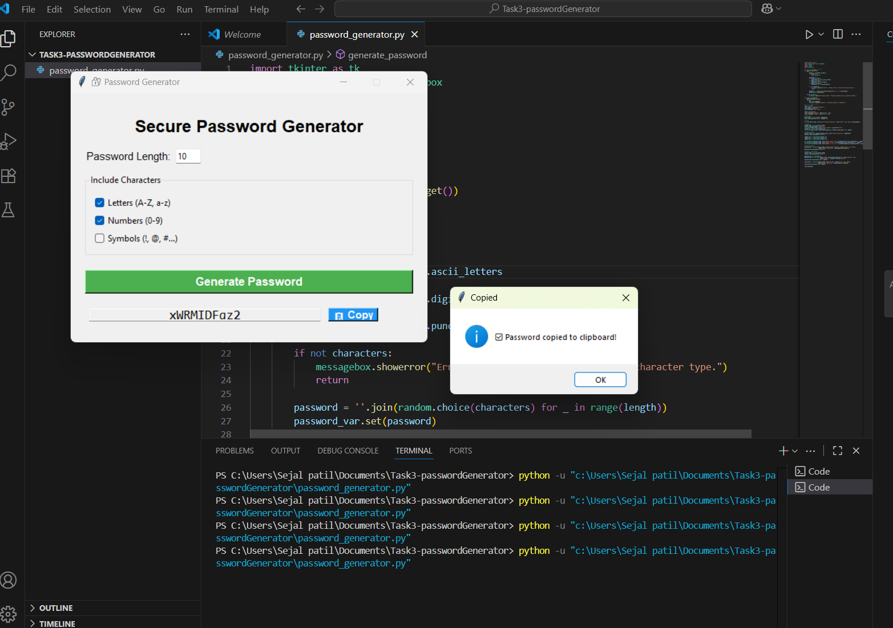

# 🔐 Password Generator

A simple yet powerful **Tkinter-based password generator** with customizable character sets and one-click copy to clipboard.  
Perfect for generating strong, secure passwords in seconds.

---

## ✨ Features
- 🎨 **User-Friendly GUI** built with Tkinter
- 🔢 Choose password length
- 🅰️ Include **letters** (A-Z, a-z)
- 🔢 Include **numbers** (0-9)
- 🔣 Include **symbols** (!, @, #, etc.)
- 📋 **One-click copy** to clipboard
- ⚡ Instant password generation

---

## 📷 Screenshot



---

## 🛠 Installation

1. **Clone the repository**
   ```bash
   git clone https://github.com/Seja-git/Task3_passwordGenerator.git
   cd Task3_passwordGenerator


password-generator/
│
├── password_generator.py   # Main Tkinter app
├── screenshot.png           # Screenshot of the app (optional)
└── README.md                # Project documentation
